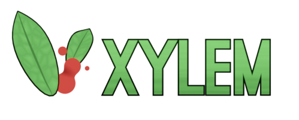

# Xylem
Xylem is a FLOSS (Free Libre and Open Source) 3d game created with Godot Engine (v3.1.2).

### Character
In Xylem, you embody a botanist explorator whose purpose is to gather new plant species.

<p align="center">
  
</p>

## Installation
Use `git clone https://github.com/johhnry/Xylem` to clone the repo.

## Usage
The game is still in development so you can directly run the project with Godot by typing : 

```
cd Xylem/godot && godot
```

For now, you control the character by moving the mouse away from the center of the window. 
You can throw seeds by clicking with left mouse button.

## Contributing
TODO

## Ressources
* [godotengine.org](https://godotengine.org)
* [blender.org](https://blender.org)
* [krita.org](https://krita.org)

## License
* [MIT](https://choosealicense.com/licenses/mit/)
* [Godot license](https://godotengine.org/license)
